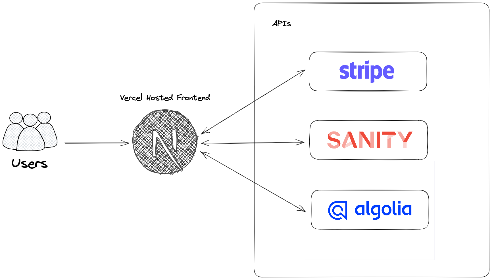

# E-commerce Platform

[Project Link](https://ecommerce-k4vh.vercel.app/)

An e-commerce platform complete with Stripe, Algolia Search Client, and Sanity.

## Tech Stack

**Client:** TypeScript, Tailwind CSS, HTML

**Backend:** Algolia, Stripe, Sanity

## Features

- Statically generated produce pages using dynamic slug values provided by Sanity allow for server side rendering and quick loading.
- Use of local storage along with custom shopping cart context allows basket to persist across multiple sessions.
- Server side payment processing using Stripe checkout sessions allows for secure creation of payment intent, preventing malicious actors.
- Use of Tailwind CSS and Framer Motion libraries allow for a smooth, responsive design and route animations.

## What next?

- Make use of React Suspense, [TanStack Query](https://tanstack.com/query/latest) along with error boundaries for better data fetching.
- Figure out a better way to handle blur event on Algolia Search Client.
- Build a design system for better consistency.

## Related

Some resources I found instrumental in helping with this project

[Henrique Doro](https://hdoro.dev/integrating-sanity-io-algolia), [Sanity Blog](https://www.sanity.io/guides/building-ecommerce-sites-with-the-stripe-api#9e523703128c)
